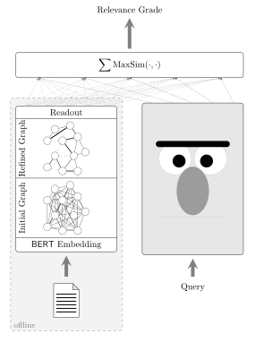

# Architecture
The proposed architecture is based on ColBERT where the document encoder is replaced by a GNN.
<center></center>


# Example:

Let `NAME` be the name of the run and `[path-to-dataset]` be the path to the dataset in h5 format. The distillation may be trained on for 20 epochs on 2 GPUs via:
```
./distillation.py \
	run_name=NAME \
	used_gpus=[0,1,2,3] \
	trainer.devices=2 \
	trainer.accelerator=gpu \
	datamodule.data_dir="[path-to-dataset]" \
	datamodule.fold_name="fold_0" \
	datamodule.batch_size=10 \
	trainer.limit_val_batches=0 \
	trainer.max_epochs=20 \
	trainer.strategy.find_unused_parameters=True
```
Also note `used_gpus=[0,1,2,3]` which sets the `CUDA_VISIBLE_DEVICES` environment variable accordingly.